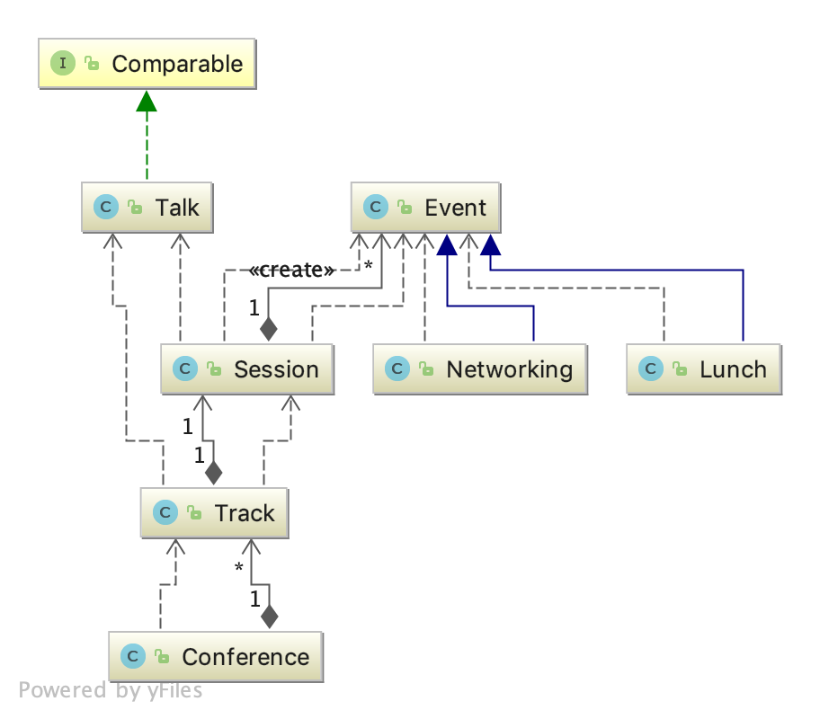

## 代码介绍

### 实体类

会议管理系统包含多个实体类

- Conference: 会议，包含多个track
- Track : 负责记录每一天的行程，所有的排期，可以包含多个Track，也就是多天
- Session : 事件的集合，有morningSession/lunchSession/afternoonSession/networkingSession 
- Event: 事件，相当于session上的槽点，talk/lunch/networking 需要转换为event后再加入到session
- Talk : 一次会议，包含的是会议标题，会议耗时。
- Lunch: 午饭时间，也作为一种event
- Networking: 一种event

### 枚举类

- DataInputEnum: 定义数据输入的类型，目前只支持file
- DataOutputEnum: 定义输出数据的类型，目前支持控制台输出

### 业务处理类

- SessionService: 负责构建上述的4种session，morningSession和afternoonSession默认没有event
- ConferenceService: 编排会议

### 工具类

- ConferenceUtils : 读取文件、生成日期、打印Schedule、打印Talks

### 使用方法
- 可以自定义Networking的开始时间，但必须在16:00 - 17:00之间
- 运行Main.main(), 随机打乱输入数据的顺序5次，输出对应的5种结果，使用者自行选择哪种方案合适